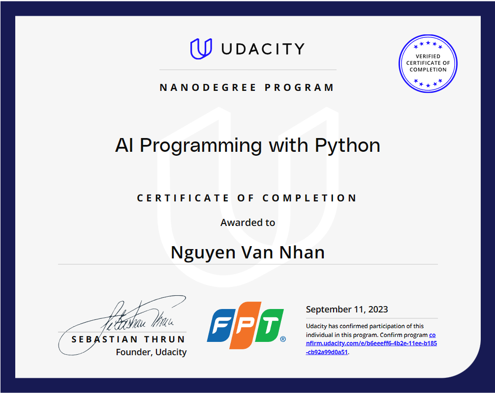

# Nguyen Van Nhan 👨‍💻

### Full-Stack Developer

---

🔭 **Tech Stack**: 

- **Languages**: PHP, Python, Java, C/C++, HTML/CSS, JavaScript, Shell
- **Tools & Technologies**: Docker, Machine Learning, MySQL, Oracle, VSCode, Luccid Chart, CI/CD, Git, Data Exchange, Data Scientist, Linux (Ubuntu, Centos)
- **Platforms**: Docker

---

📖 **Bio**:

In the process of growing up and self-improvement, I have constantly embraced many wonderful things through reading books or having conversations with people around me. Each person is a unique world in terms of their work, thinking style, and different attitudes towards life. However, I have come to realize that as long as you know how to listen and ask the right questions at the right time, you will discover many valuable things for yourself.

---

🌐 **Connect with me**:

---

🌟 **Projects**:

- **[Image Classifier Project](https://github.com/nvnhann/AI-Create-Your-Own-Image-Classifier)**: This project allows you to create and train your own image classifier using PyTorch

- **[Give your Application Auto-Deploy Superpowers](https://github.com/nvnhann/Deploy-a-high-availability-web-app-using-CloudFormation)**: Explain the fundamentals and benefits of CI/CD to achieve, build, and deploy automation for cloud-based software products
  
- **[Operationalize a Machine Learning Microservice API](https://github.com/nvnhann/Operationalize-a-Machine-Learning-Microservice-API)**: In this project will apply the skills you have acquired in this course to operationalize a Machine Learning Microservice API

---

❓ **Ask me about**: Full Stack Development, Docker, Machine Learning, or any tech-related stuff.

💬 **Fun Fact**: I believe in the power of the right questions!

---

📈 **GitHub Stats**:

---
### Udacity - 2024

    

    
    

    
    

### Udacity - 2023

    
    

    
    

    
    

    
    

    
    

    
    

    
    

    

